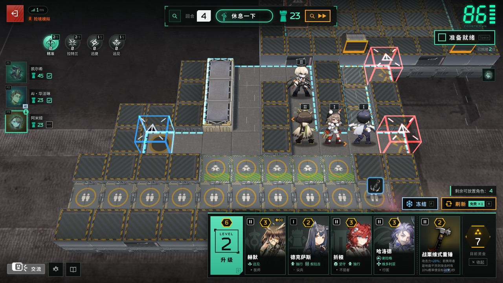
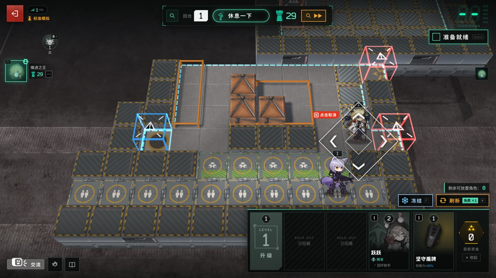
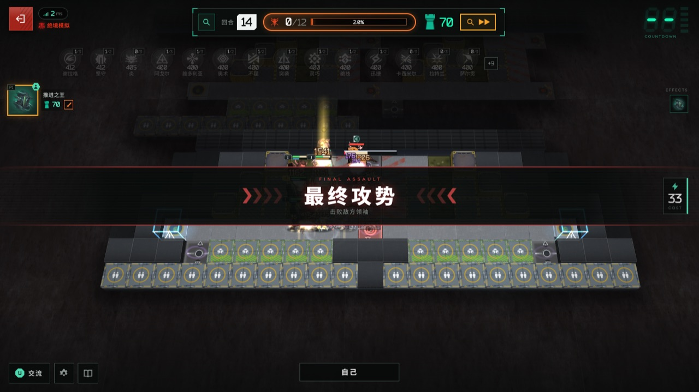

# 卫戍协议：盟约 · Stronghold Protocol: Alliance

An **unofficial fan-made remake** of *Arknights*' seasonal auto-chess tower-defense mode **"Stronghold Protocol: Alliance"** — playable directly in your browser, solo or in 1–4 player co-op.


## ✨ What's New (Latest Features)

- **Crisis Simulation Mode (Contingency Contract Matrix)**: Take on customizable high-risk challenges in both Solo and Alliance modes. Configure interlocking contracts across multiple categories (*Enemy Enhancements*, *Battlefield Environment*, *Tactical Restrictions*, and *Support Contracts*), track your total **Crisis Level** (`▲1`–`▲3` per risk tier), and test your squad against extreme modifiers.
- **Endless Simulation Mode**: Push your defense beyond Round 15 (*Hidden Core*) into infinite waves! Enemy stats scale progressively with each round, featuring recurring Boss encounters every 5 rounds and periodic Strategist's Choice drafts.
- **Shop Duplicate Highlighting**: Recruitment shop cards now display an unmistakable **yellow/gold border, glow, and copy badge (`×1` / `×2`)** whenever an offered operator matches copies you already own on the battlefield or reserve bench — making it effortless to spot merge opportunities and 1-off Elite promotions at a glance.
- **Complete Bahasa Indonesia (`id`) Localization**: Full 100% Indonesian language support covering all 1,150+ UI/server strings as well as the complete game-data overlay (Operators, Skills, Talents, Traits, Strategies, Bonds, Bosses, Equipment, Garrisons, and Strategist's Choices).
- **Custom Squads, Stand-In Operators & Spectator Mode**: Build your own Custom Squad (*DIY slots*), automatically fill unowned operators with official Stand-In operators, customize keyboard shortcuts, and invite up to 2 friends to watch live via Spectator Mode.

---

## Disclaimer

> [!IMPORTANT]
> - This project is an **unofficial, fan-made work** and is **not affiliated with, authorized, or endorsed by** Hypergryph (上海鹰角网络科技有限公司), Yostar, or any of their affiliates.
> - All *Arknights* and *Stronghold Protocol* names, characters, artwork, music, sound effects, text, and game data are the copyrighted property of their respective owners. These assets are **not covered** by this project's GPL-3.0 license; the GPL applies solely to the original source code written for this project.
> - Strictly for **educational exchange and personal non-commercial use**. **Any form of monetization is strictly prohibited**, including but not limited to: selling this project or its bundles, paid downloads or paid distribution, paid hosting or server rentals, ads / donations / memberships, or any other commercial use.
> - The source repository does not contain game artwork or audio assets (only data generated from official data tables and a few screenshots, which are likewise excluded from the GPL). The full bundle in [Releases](../../releases/latest) includes assets for player convenience (the lite bundle does not, and downloads them from public mirrors on first launch); downloading constitutes agreement to this disclaimer. Do not use the assets outside this project or redistribute them separately. See [NOTICE.md](NOTICE.md) for full terms.
> - If any rights holder believes this project infringes upon their rights, please contact us via an Issue and we will **immediately remove** the relevant content.
> - This project is provided **"as is" without warranty of any kind**. Use at your own risk.

| Alliance Room | Strategy Draft | Prep Phase (Shop / Bonds) |
|---|---|---|
|  |  |  |
| **Deployment Facing Wheel** | **Combat** | **Final Assault** |
|  |  |  |

## Table of Contents

- [What's New](#-whats-new-latest-features) · [Disclaimer](#disclaimer) · [Introduction](#introduction) · [Features Overview](#features-overview)
- [Quick Start](#quick-start): [Release Bundles](#option-1-release-bundle-recommended) · [Run from Source](#option-2-run-from-source) · [System Requirements](#system-requirements) · [Port & Configuration](#port--configuration) · [LAN Co-op](#playing-with-friends-lan)
- [Multiplayer Hosting](#multiplayer-hosting) · [Controls](#controls) · [Documentation](#documentation) · [Development & Testing](#development--testing) · [Project Structure](#project-structure)
- [License](#license) · [Credits & Data Sources](#credits--data-sources) · [Contributing](#contributing)

## Introduction

*Stronghold Protocol: Alliance* combines auto-chess economy with Arknights tower defense: during the **Prep Phase**, recruit operators in the Dispatch Center, arrange your formation, and equip gear; during the **Combat Phase**, operators deploy automatically to intercept waves of enemies pouring out of red gates, while any leaked enemies deduct from your Objective Life Points (LP). This project recreates the mode *Stronghold Protocol: Alliance* in the browser, matching official data tables and PRTS mechanics as closely as possible.

- **Solo Simulation** (single-player) and **Alliance Simulation** (1–4 player **co-op**, no PvP; empty seats can be filled with AI teammates).
- The server is a lightweight Node.js process while **combat is simulated in each player's browser** (just like the official client). The server only manages economy and round progression, so even a low-power mini-PC or VPS can host smoothly.
- Current version `0.2.0`: adds Stand-In Operators, Custom Squads (DIY), Crisis Simulation, Endless Simulation, duplicate shop highlighting, multi-language support (**简体中文**, **English**, **Bahasa Indonesia**, **日本語**, **한국어**, **繁體中文**), and customizable hotkeys, alongside fixes for community feedback since `0.1.4` (see [CHANGELOG.md](CHANGELOG.md)). A few edge-case rules are implemented by inference — if you spot any discrepancy with the official game, feel free to open an Issue.

## Features Overview

- **Complete Match Flow**: Match Briefing → Strategy Draft (40 Strategies) → 14 Rounds → Result & Commendations; on *Perilous* difficulty and above, meeting the condition unlocks Round 15 **"Hidden Core"** (and **Endless Simulation** continues infinitely beyond Round 15).
- **6 Simulation Modes**: *Standard* / *Perilous* / *Dire* / *Apex* / *Endless* / *Crisis*, with separate solo and co-op parameters derived from official data plus customizable Contingency Contracts in Crisis mode.
- **Prep Phase**: Recruit, refresh, freeze, and upgrade the Dispatch Center; Reserve Bench and Temporary Bench; drag from the bench onto the board and choose facing with the **Facing Wheel**. Shop cards you already own (`1/3` or `2/3` copies) are highlighted in yellow/gold. Alliance Simulation shares a common operator pool.
- **Elite Promotion**: Collecting 3 copies of the same operator automatically merges them into an Elite copy and grants a free recruitment reward one tier higher. If a merge consumes an already-deployed copy, the Elite appears directly on that copy's board tile.
- **Operators & Loadouts**: 112 recruitable operators (+ Elites) with their skills, talents, and traits; before a match starts, you can select each operator's active skill (all 283 skills hand-implemented) and Elite module.
- **Bonds & Layers**: 23 Bonds (8 core faction bonds + secondary bonds). Bond layers persist for the entire match, up to the official cap of 999 layers per bond.
- **Equipment & Strategist's Choice**: Equipment and spells; identical equipment merges, and specific combinations grant bond effects. Equipped items are locked onto the operator until sold or merged. Selected rounds begin with a Strategist's Choice card draft (gear, funds, operators, bond layers, bounties, etc.).
- **Automated Combat**: Skills cast automatically according to official skill-trigger rules; blocking uses contact radius, and when a blocker falls, another operator in contact immediately takes over; elemental damage and elemental bursts; summons are placed manually by the player and skill summons deploy once for free at battle start; push/pull physics calculated by force vs. weight; knocked-out operators remain on their tile displaying a redeploy countdown.
- **Terrain & Enemies**: Roadblocks, ranged platforms, Originium gale blowers, swamps, exhaust grilles, rising tides, and more; aerial, low-altitude hovering, and bounty enemies.
- **Joint Defense (Unite)**: When a player leaks enemies and a teammate achieves a flawless defense, the flawless teammate brings their squad to help intercept the leaked enemies.
- **Final Assault & Hidden Core**: Pairs of players share a battlefield while the entire team whittles down a shared Boss HP bar; 10 enemy Bosses, huge Bosses with ~5×3 tile hitboxes, and the official 300,000 per-hit damage cap.
- **Commendations**: 6 end-of-match titles including *Star of the Stronghold*, *Immortal Alliance*, and *Solid as a Rock*.
- **Disconnect & Reconnect**: Reopen the page within **10 minutes** in Alliance Simulation to reclaim your seat (your squad fights automatically while disconnected, or you can toggle "AFK" to let AI take over); Solo Simulation matches can be resumed within **24 hours** in the same browser.
- **Quality-of-Life Details**: Top-bar Objective LP updates in real time as enemies leak (finalized at settlement); clicking, dragging, and equipping all snap to ground tiles; buying, upgrading, and Strategist's Choice drafts use a two-tap confirmation; single-human matches have untimed prep phases.
- **Visuals & Audio**: Authentic Spine chibi animations, official BGM, sound effects, operator battle voice lines, emotes (6 sets × 6 emotes), and combat VFX; optional official 3D board (requires extracting textures from a local Arknights PC client).
- **Mobile & Desktop**: Touch drag-and-drop and long-press to inspect details (landscape mode recommended); graphics quality can be lowered in Settings.

## Quick Start

### Option 1: Release Bundle (Recommended)

Two pre-packaged bundles are available on the [Releases](../../releases/latest) page with identical code and runtime dependencies:

- **Full Bundle** `Stronghold-Protocol-v<version>.zip` (~430 MB, ~625 MB unzipped): Includes all artwork and audio (including official 3D board textures). Unzip and play immediately with no extra downloads. **Recommended.**
- **Lite Bundle** `Stronghold-Protocol-v<version>-lite.zip` (~22 MB): Contains no art assets; on first launch it automatically downloads artwork, Spine models, audio, fonts, emotes, and "How to Play" tutorial images (~460 MB, resumable if interrupted) from public mirrors. Local-client-only assets such as the official 3D board are not included in the mirror download (see "Local Client Assets" below). Ideal when downloading a single large archive is inconvenient.

Both bundles contain only the files needed to run and deploy the game (server, client, data, launch scripts, setup/doctor/asset tools, licenses, [docs/PLAYING.md](docs/PLAYING.md), and [docs/DEPLOY.md](docs/DEPLOY.md)); tests, dev tools, and design docs live in the source repository.

1. **Install Node.js 22 or 24 (LTS)**
   - Windows: Run `winget install OpenJS.NodeJS.LTS` in PowerShell, or download the installer from <https://nodejs.org/en/download>.
   - macOS: `brew install node@22`, or download the installer from the official website.
   - Linux: Use your distro's package manager, `nvm`, or `fnm`.
2. **Download**: Grab the latest Full Bundle (or Lite Bundle) from [Releases](../../releases/latest) and extract it to a folder with a short path (on Windows, avoid placing it inside a OneDrive-synced folder).
3. **Launch**
   - Windows: Double-click **`scripts\start-windows.bat`**. If a security prompt appears, click "Run"; when the Windows Firewall prompt appears, check "Private networks" and allow access.
   - macOS / Linux: Run `./scripts/start.sh` (or `bash scripts/start.sh`) inside the extracted folder.
4. Your browser will automatically open `http://localhost:3000`. Share the LAN address printed in the terminal window with friends on the same network. Close the terminal window (or press `Ctrl+C`) to stop the server.

### Option 2: Run from Source

```bash
git clone https://github.com/sganggs/Stronghold-Protocol.git
cd Stronghold-Protocol
npm install        # Install dependencies (postinstall copies pixi / preact / three to public/vendor)
npm run setup      # Check environment and download ~460 MB of art/audio from public mirrors (resumable)
npm start          # Start server at http://localhost:3000
```

You can also run the launch scripts directly (`scripts\start-windows.bat` on Windows, `scripts/start.sh` on macOS / Linux): on first run they automatically install dependencies, download assets, start the server, and open your browser.

- **Local Client Assets (Optional)**: The official 3D board, certain official HUD icons (emote button/wheel frames, module type icons, etc.), the Searing / Blazing Originium Slug models, and 39 summon models (mostly DIY summons) are extracted from a local *Arknights* PC client (Windows native client, or CrossOver / PlayCover on macOS). When `npm run setup` detects a local client, it will ask if you want to extract them (requires Python 3.8+; dependencies are installed into an isolated `.venv-extract` folder inside the project). You can re-extract later with `node tools/setup.mjs --local`, or specify a path via `--game "<…/StreamingAssets/AB/Windows>"`. Without a local client, the game runs normally using clean fallbacks: a 2D board, matching vector icons, tinted Originium Slugs, and summon avatars. Emotes and "How to Play" tutorial pages are downloaded automatically from the public mirror alongside the main assets and do not require a local client. Headless servers without a game client (such as a Linux VPS) can also copy `public/assets/local/` and `data/local-assets.json` from the **same version's** Full Bundle (see "Local Client Assets" in [docs/DEPLOY.md](docs/DEPLOY.md)).
- Asset downloads try GitHub first and automatically fall back to jsDelivr mirrors.
- Run `npm run doctor` (`node tools/doctor.mjs`) at any time to check your Node version, asset completeness, port availability, LAN addresses, and firewall status.

### System Requirements

| Component | Requirement |
|---|---|
| Host Machine | Windows / macOS / Linux, Node.js 22 or 24 (LTS); ~600–750 MB disk space (assets, dependencies, and extracted textures: ~625 MB for the unzipped Full Bundle); ~100 MB free RAM + a few MB per active match |
| Players | Modern browser with WebGL support (latest Chrome / Edge / Firefox / Safari) on desktop, phone, or tablet (landscape) |
| Network | On first visit, each player downloads several dozen MB of assets from the host (cached by the browser thereafter); in-match traffic is minimal |

On lower-end GPUs, lower the graphics preset in **Settings**, or append `?board=2d` (force 2D board) or `?render=fallback` (lightweight non-WebGL renderer) to the URL.

### Port & Configuration

Listens on **TCP 3000** by default. To change the port, pass `--port 3001` to the launch script or set the `PORT` environment variable.

| Variable | Default | Description |
|---|---|---|
| `PORT` | `3000` | Listening port |
| `HOST` | `0.0.0.0` | Bind address (`127.0.0.1` = localhost only, useful behind a reverse proxy) |
| `SP_COMBAT` | `client` | `client`: each player's browser simulates its own combat (minimal server CPU); `server`: server simulates and streams frames |
| `SP_VERIFY` | `off` | Server verification of client-reported combat results: `off` / `sample` (~1/8 spot check) / `all` (re-simulate every battle, higher CPU) |
| `TRUST_PROXY` | `auto` | Whether to trust `X-Forwarded-For` headers: `auto` trusts loopback/private-network proxies only; `1` always; `0` never |
| `SP_NO_BROWSER` | empty | Set to `1` to prevent launch scripts from automatically opening a browser window |

Setting variables: macOS / Linux `PORT=8080 npm start`; PowerShell `$env:PORT=8080; npm start`; cmd `set "PORT=8080" && npm start`. Health check endpoint: `GET /healthz`.

### Playing with Friends (LAN)

1. Open the game → enter your nickname → **Alliance Simulation** → Create Room. The host selects the difficulty (and Crisis contracts if playing Crisis mode), can add/remove AI teammates, and can remove other Doctors before the match starts (they can rejoin with the room key).
2. Share the 4-letter **Alliance Key** or the `http://<address>:3000/?room=KEY` link from "Copy Link" with your friends.
3. Once everyone clicks **Ready**, the host starts the match.
4. Friends on the same Wi-Fi / router simply open the LAN address shown in the server window (e.g., `http://192.168.x.x:3000`). If they cannot connect, it is usually the firewall: allow "Private networks" on Windows first launch, or run `npm run doctor` for exact firewall commands; note that Guest Wi-Fi networks often enable "AP Isolation", which blocks peer-to-peer LAN connections.

If you refresh or disconnect, reopen the page within **10 minutes** (Alliance Simulation) or **24 hours** (Solo Simulation) to return to your seat. Rooms and active matches are kept in memory — **restarting the server ends all active matches**.

## Multiplayer Hosting

When your friends are not on the same LAN, choose one of the common setups below. The tools and services mentioned are examples only (this project is not affiliated with and does not endorse any of them). For detailed deployment instructions (firewalls, auto-start, reverse proxies, HTTPS, Docker), see **[docs/DEPLOY.md](docs/DEPLOY.md)**.

| Method | How It Works | Best For |
|---|---|---|
| **Direct LAN** | Share the LAN URL printed in the startup console | Same house, dorm, or local network |
| **Virtual LAN (Mesh VPN)** | Tools like Tailscale, ZeroTier, or EasyTier: the host and friends join the same virtual network and connect via `http://<virtual-IP>:3000` | Small group of regular friends without exposing a public port |
| **Tunneling / Reverse Proxy** | Only the host runs a client and shares a public URL — e.g., self-hosted `frp`, or Cloudflare `cloudflared tunnel --url http://localhost:3000` | No router access or public IP; note that free tunnels may throttle initial asset downloads |
| **Cloud Server / VPS** | Run the release bundle or `Dockerfile` on a VPS behind Caddy / Nginx with HTTPS | Dedicated 24/7 server for players across different regions |

General notes:

- The game runs as a **single stateful Node.js process + WebSocket** (`/ws`) at the domain root. Serverless platforms (such as Vercel) and static hosts (such as GitHub Pages) are not supported. Ensure your reverse proxy forwards WebSocket upgrade headers.
- There is no account system — **anyone with the URL can join**. Share your server address only with friends and do not host public lobbies.

## Controls

| Action | How To |
|---|---|
| Buy / Upgrade Dispatch Center / Strategist's Choice | Tap once to select, tap a second time to confirm (`D` to upgrade) |
| Deploy / Move Operator | Drag from the bench to a board tile → the Facing Wheel appears → slide Up / Right / Down / Left and release to set facing; release in the center or tap `✕ Cancel` to abort. Selection and placement always snap to the ground tile under the pointer |
| Change Facing | Drag a deployed operator onto its own tile, then choose the new direction |
| Sell / Retreat / Destroy Item | Tap the unit's tile → use the bottom bar buttons (`Sell +1`, `Retreat`), or drag a deployed operator back to the bench to retreat. Equipment and spells in the bench can only be `Destroyed`; equipped items are locked onto operators until the operator is sold or merged into an Elite |
| Equip Gear / Cast Spell | Drag equipment onto an operator's tile (up to 2 items per operator; equipping a 3rd opens a replacement prompt and destroys the replaced item). Drag spells onto a board tile and choose a direction |
| Inspect Details | Right-click or long-press any unit or card (stats are shown live: green when above base, red when below) |
| Hotkeys | `R` Refresh · `F` Freeze · `D` Upgrade · `Q` Retreat / `X` Sell selected operator · `Space` Ready · `Esc` Cancel / Close; all keys except `Esc` can be rebound in **Settings → Hotkeys** ([Playing Guide §11](docs/PLAYING.md#11-快捷键)) |
| Facing Wheel via Keyboard | Arrow keys to preview direction · `Enter` to confirm · `Esc` to cancel |
| Pause (Solo Simulation) | During combat (including Final Assault / Hidden Core), click **Pause** in the top bar or press `Space`, then click **Resume** (or `Space`) to continue; Alliance Simulation combat cannot be paused |
| Emotes | Click **Communicate** in the bottom-left corner, swipe left/right (or use arrow keys) to switch emote sets (1s cooldown) |
| Spectate | After your own combat ends (or during Prep), click a teammate's avatar on the left → **Watch**; non-playing friends can enter the 4-letter room key in the lobby and click **Spectate** (up to 2 spectators per room) |

For complete rules, formulas, and tips, see **[docs/PLAYING.md](docs/PLAYING.md)** (also accessible in-game via the "How to Play" button in the bottom-left corner).

## Documentation

| Document | Contents |
|---|---|
| [CHANGELOG.md](CHANGELOG.md) | Release notes: what each version added or fixed, and verified community reports |
| [docs/PLAYING.md](docs/PLAYING.md) | Player Guide: match flow, economy, recruitment & promotion, formation, Joint Defense, bonds, Final Assault, commendations |
| [docs/DEPLOY.md](docs/DEPLOY.md) | Deployment Guide: Windows hosting & auto-start, firewall, virtual LAN / tunnels, reverse proxy & HTTPS, Docker, systemd, troubleshooting |
| [docs/WINDOWS.md](docs/WINDOWS.md) | Windows Portable Bundle: how to build a zero-install bundle (`scripts/make-windows-bundle.mjs`), bundle contents, and licensing notes |
| [docs/DESIGN.md](docs/DESIGN.md) | Architecture & Design Contract: section index pointing to current rules in `docs/design/` and historical playtest revisions in `docs/history/` |
| [docs/ARCHITECTURE.md](docs/ARCHITECTURE.md) | Code Map: server, multiplayer protocol, shared combat simulator, directory layout, data flow, golden tests, and where to start when making changes |
| [CONTRIBUTING.md](CONTRIBUTING.md) | Contributing Guide: environment setup, running tests, faithfulness principles, commit/PR conventions, and how to add DIY operators |
| [docs/SIM.md](docs/SIM.md) | Combat Simulation Engine Reference: hooks, skill descriptors, and class default behaviors |
| [docs/META.md](docs/META.md) | Match & Economy Engine: round flow, shop, Joint Defense, and Final Assault implementation details |
| [docs/DATA.md](docs/DATA.md) | Game Data Reference: schema of JSON data generated from official tables |
| [docs/ASSETS.md](docs/ASSETS.md) | Asset Sources, Directory Layout, and Manifest Reference |
| [docs/I18N.md](docs/I18N.md) | Localization Guide: how UI strings, game data overlays, and server messages are translated; **adding a language only requires placing a language file in `public/i18n/`** (see [docs/PACKS.md](docs/PACKS.md) for content packs) |
| [docs/BALANCE.md](docs/BALANCE.md) | Difficulty Model & Balance Measurements |
| [docs/research/](docs/research/00-INDEX.md) | Research notes on official mechanics, data tables, and UI behavior |

## Development & Testing

```bash
npm run dev                 # node --watch: auto-restart server on code changes
node --test                 # Unit + integration tests (~3170 tests; browser/asset-dependent tests auto-skip if unavailable)
SP_E2E=1 node --test test/ui/mock.e2e.test.js        # Browser E2E tests (requires local Chrome; set CHROME_PATH if needed)
SP_REAL_E2E=1 node --test test/ui/real.e2e.test.js   # Requires Chrome + downloaded assets
RENDER_E2E=1 node --test 'test/render/*.browser.test.js'   # Render tests (some require locally extracted board textures)
GOLDEN_FULL=1 node --test test/golden.test.js           # Golden results: fixed-seed combat & bot match digests (runs fast subset by default)
```

- Game data is generated from official data tables via `npm run build-data` (`tools/build-data.mjs`); do not hand-edit `data/*.json`.
- Pure refactoring commits must not alter `test/golden/*.json`; when intentionally changing gameplay mechanics, run `npm run golden:update`, review the diff, and commit it alongside your changes (see [test/golden/README.md](test/golden/README.md)).
- GitHub Actions ([.github/workflows/ci.yml](.github/workflows/ci.yml)) runs `npm ci`, `node --test`, and server smoke tests across Ubuntu and Windows on Node 22 and 24.
- See [docs/ARCHITECTURE.md](docs/ARCHITECTURE.md) for an overview of the codebase layers and where to make rule changes.

## Project Structure

| Path | Contents |
|---|---|
| `server/` | Entry point `index.js`; Node HTTP static server + WebSocket (`/ws`, in `http/`), lobby, match engine (`match/`), and combat simulator (`sim/`, shared between browser and server) |
| `shared/` | Constants, contracts, i18n, and network protocol shared between frontend and backend |
| `public/` | Browser client (native ES modules, PixiJS + pixi-spine, Three.js 3D board, Preact + htm UI) |
| `data/` | Generated game data (`*.json`), language overlays (`data/i18n/`), and asset manifest `assets.json` |
| `tools/` | `setup.mjs` / `doctor.mjs`, asset downloader `fetch-assets.mjs`, data & i18n builders, local client extractor `local-extract/` |
| `scripts/` | Launch scripts (Windows / macOS / Linux) and Windows startup helpers |
| `docs/` | Documentation and research notes |
| `test/` | `node:test` test suite |

## License

- **Source Code**: Original code written for this project is released under **GPL-3.0-or-later** (see [LICENSE](LICENSE)), with an additional permission under GPL Section 7 allowing distribution alongside the Spine Runtimes in `pixi-spine` (see [NOTICE.md](NOTICE.md)).
- **Game Assets Excluded**: All *Arknights* artwork, music, sound effects, voice lines, text, and data remain the property of their respective copyright holders and are **not** covered by the GPL. See the [Disclaimer](#disclaimer) above and [NOTICE.md](NOTICE.md) for usage restrictions.
- **Third-Party Components**: Governed by their respective licenses, including npm packages, the LZ4AK decompression algorithm in `tools/local-extract/aklz4.py` (BSD-3-Clause), and fonts. See [THIRD-PARTY-NOTICES.md](THIRD-PARTY-NOTICES.md) for the complete list and license texts.

## Credits & Data Sources

- Game Data: [Kengxxiao/ArknightsGameData](https://github.com/Kengxxiao/ArknightsGameData).
- Asset Mirrors: [yuanyan3060/ArknightsGameResource](https://github.com/yuanyan3060/ArknightsGameResource), [fexli/ArknightsResource](https://github.com/fexli/ArknightsResource), [isHarryh/Ark-Models](https://github.com/isHarryh/Ark-Models), [ArknightsAssets/ArknightsAssets2](https://github.com/ArknightsAssets/ArknightsAssets2); fonts from [TimWangZi/The-font-of-Arknights](https://github.com/TimWangZi/The-font-of-Arknights) and Google Fonts (Noto Sans SC). See [docs/ASSETS.md](docs/ASSETS.md) for details.
- Mechanics Verification: [PRTS Arknights Wiki](https://prts.wiki/).
- LZ4AK Unpacking: Algorithm in `tools/local-extract/aklz4.py` from [isHarryh/Ark-Unpacker](https://github.com/isHarryh/Ark-Unpacker) (BSD-3-Clause, via MooncellWiki/UnityPy); Unity asset parsing via [UnityPy](https://github.com/K0lb3/UnityPy) (MIT).
- Libraries: [PixiJS](https://pixijs.com/) (MIT), [pixi-spine](https://github.com/pixijs/spine) (MIT; bundled Spine Runtime subject to the [Spine Runtimes License](https://esotericsoftware.com/spine-runtimes-license)), [three.js](https://threejs.org/) (MIT), [Preact](https://preactjs.com/) + [htm](https://github.com/developit/htm) (MIT), [ws](https://github.com/websockets/ws) (MIT).

Special thanks to the authors and maintainers of the projects above, and to Hypergryph for creating *Arknights*.

## Contributing

Bug reports, rule discrepancy reports, and Pull Requests are welcome:

- See [CONTRIBUTING.md](CONTRIBUTING.md) for environment setup, test commands, faithfulness guidelines, and commit conventions.
- Please run `node --test` and update relevant documentation before submitting a PR.
- Contributed code will be licensed under GPL-3.0-or-later.
- Never commit game asset files (`public/assets/` and related directories are ignored by `.gitignore`).
- This project is strictly non-commercial: please do not submit ads, paywalls, donation links, or monetization features of any kind.
